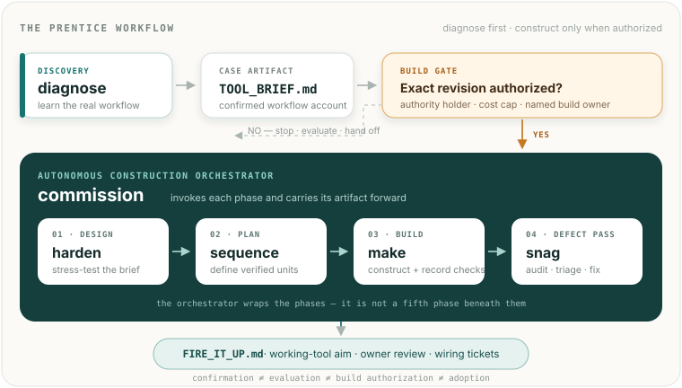

# Prentice

**Evidence-linked workflow diagnosis, with optional governed construction.**

Prentice is an **experimental, structurally complete system of six Agent Skills** for turning workflow friction into an evidence-linked, confirmed workflow case. Its core skill, `diagnose`, maps a recent real workflow, records evidence, corrections, contradictions, and affected handoffs, then produces `TOOL_BRIEF.md`.

A case may recommend software, a process or handoff change, training, policy clarification, an existing tool, further observation, or no action. Construction is optional and separately authorized.

These files are Markdown instructions to an AI model — not an application or enforcement runtime. They can guide behavior; they cannot guarantee model adherence, diagnosis quality, safe code, security, deployment, or adoption.

> **diagnose → confirmed workflow case → exact-revision build authorization → commission → prototype / v1 + handoff → user acceptance**

<p align="center">
  
</p>

`commission` is the autonomous construction orchestrator, not a fifth build phase beneath the others. It wraps `harden`, `sequence`, `make`, and `snag`, carries their artifacts forward, and hands back both the proposed prototype/V1 and `FIRE_IT_UP.md` — the start-up, review, and wiring document. `diagnose` remains the highest-priority product hypothesis to validate because its workflow case may be useful even when no software should be built; that validation priority does not make it the build orchestrator.

## Who it is for

Prentice is for an operator or facilitator helping someone examine a real workflow — especially when that person knows what hurts but does not yet know what intervention to request. It is not a self-serve application, a production automation platform, or a substitute for technical and security review.

`diagnose` normally stops at a confirmed case. Its three states are deliberately separate:

- **Accuracy** — the participant confirms that one exact revision represents the workflow accurately.
- **Evaluation** — a named decision-holder may select that revision for further assessment.
- **Build authorization** — a named authority may authorize construction of that exact revision, with a cost cap and named build owner.

Confirmation is not selection. Selection is not permission to build. None of the three is evidence of correctness, adoption, or production readiness.

## The skills

| Layer | Skill | Role |
|---|---|---|
| **Discovery** | **`diagnose`** | Core hypothesis: produces an evidence-linked workflow case the participant can confirm; normally stops there |
| **Autonomous construction** | **`commission`** | Takes one exact authorized revision and orchestrates the optional build chain end to end |
| **Invoked by `commission`** | **`harden`** | Optionally stress-tests the authorized design without reopening its worth |
| **Invoked by `commission`** | **`sequence`** | Plans construction from the exact authorized revision |
| **Invoked by `commission`** | **`make`** | Executes authorized units and records the checks performed; does not independently assure correctness |
| **Invoked by `commission`** | **`snag`** | Runs a bounded post-build defect pass and preserves the remaining technical tail |

Run a build phase directly when you want to control that phase by hand. Invoke `commission` when the exact brief revision has been authorized and you want the suite to fly the construction chain autonomously.

## Current evidence

| Evidence class | Current state |
|---|---|
| **Repository structure** | All six intended skill spines and their references are present. This is structural completeness, not behavioral validation. |
| **Mechanical installation** | `scripts/verify.sh` has completed an isolated Claude plugin installation. Its exact scope is documented in [`docs/VALIDATION.md`](docs/VALIDATION.md). |
| **Self-use** | Drew reports one end-to-end author self-run, **n=1**. No published run artifact independently verifies its detailed claims. |
| **Outside use** | No outside participants, external adoption evidence, or department cohort. |
| **Technical assurance** | No independent code, security, scalability, or production review of tools produced by the pipeline. |

`diagnose` is the **highest-priority hypothesis to validate** because it may be independently useful even when no software should be built. An evidence-linked workflow case can reveal the actual friction, affected handoffs, and a better intervention. That is currently a product thesis, **not a proven wedge**.

Department synthesis is **not implemented**. A possible future manual experiment is described in [`docs/DESIGN.md`](docs/DESIGN.md); there is no department skill or department-level capability claim today.

## Quick start

This is the public, sanitized release repository. Real cases, briefs, evidence, fixtures, and generated tools belong in their separately cleared workspaces, not in this source tree.

```bash
git clone https://github.com/nelsonwerd/prentice.git
claude plugin marketplace add ./prentice
claude plugin install prentice@nelsonwerd-prentice
```

Restart the client, then start with:

> *Help me figure out what part of my job I could automate.*

To pull updates: `claude plugin update prentice@nelsonwerd-prentice`.

**Requirements:** a Claude client that loads Agent Skills and an account approved for the material being processed. Prentice has no service or model account of its own. The optional build skills use [`didrun`](https://github.com/nelsonwerd/didrun) when available and label unwrapped checks **UNRECEIPTED** when it is not; no receipt tool is required to use `diagnose`.

## Honest bounds

- Skills guide a model; they do not enforce behavior.
- A confirmed workflow case is not a successful intervention or adoption result.
- AI-assisted build output remains owned by the named build/technical owner. Passing checks and receipts are evidence about what ran, not independent correctness, security, scalability, or production assurance.
- IT, security, access, domain, evaluation, construction, and acceptance are separate decision hats. One person may hold several only when that is recorded explicitly.
- No outside pilot, department synthesis, or production deployment is claimed here.
- This repository is the sanitized release tree with fresh history. The private development archive and its earlier case-derived history are intentionally separate; see [`docs/DATA-HANDLING.md`](docs/DATA-HANDLING.md).

## Documentation

- [`docs/DESIGN.md`](docs/DESIGN.md) — current design decisions, reversals, and the unimplemented department hypothesis
- [`docs/VALIDATION.md`](docs/VALIDATION.md) — evidence classes, verifier scope, chronology, receipts, and validation ladder
- [`docs/DATA-HANDLING.md`](docs/DATA-HANDLING.md) — clearance, storage, fixtures, credentials, Git boundaries, and public-release hygiene

## Relationship to `idea-to-ship`

[**`idea-to-ship`**](https://github.com/nelsonwerd/idea-to-ship-skills) is a published suite for taking a market-facing idea through research and implementation. Prentice is a standalone derivative of that architecture, adapted for evidence-linked workflow discovery and optional governed construction for one known person or team. Neither repository imports the other at runtime, and both install side by side under different marketplace names.

## Repository layout

```text
skills/              six skill spines plus references loaded on demand
docs/DESIGN.md       current decisions and reversals
docs/VALIDATION.md   what has and has not been demonstrated
docs/DATA-HANDLING.md data and publication boundaries
scripts/verify.sh    narrow structural, contract, and isolated-install checks
.claude-plugin/      plugin and marketplace manifests
```

User artifacts such as `TOOL_BRIEF.md`, raw evidence, fixtures, build ledgers, and generated tools belong in their cleared case workspace, not in this source repository. See the data-handling policy before using real workplace or client material.

## License

MIT © Drew Nelson
